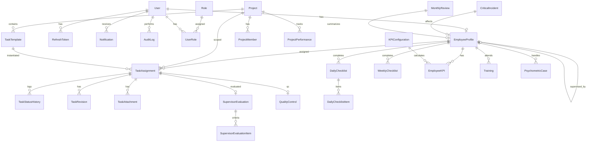

# Database Design

## ERD Overview

## Core Entities (Phase 1)

### User
- Authentication account (mobile + password hash)
- Links to EmployeeProfile
- Roles via UserRole junction

### Role
- SUPER_ADMIN, CEO, SUPERVISOR, EMPLOYEE
- Permissions via RolePermission

### EmployeeProfile
- Extended profile (name, personnel code, supervisor, projects, etc.)
- One-to-one with User

### Project
- Project master data with code, status, manager

### Setting
- Key-value configuration store for system settings

## Indexing Strategy

| Table | Index | Purpose |
|-------|-------|---------|
| users | mobile (unique) | Login lookup |
| task_assignments | employeeId, status, deadline | My Tasks queries |
| task_assignments | projectId | Project filters |
| notifications | userId, isRead | Notification center |
| employee_kpis | employeeId, period | KPI dashboard |
| audit_logs | userId, createdAt | Audit queries |

## Soft Delete Policy

Entities with `deletedAt`:
- User, EmployeeProfile, Project, TaskTemplate, TaskAssignment

Entities with `isActive`:
- Project, TaskTemplate, User

## Privacy Rules

- **PsychometricCase**: Only `caseId` — NO client PII
- Audit logs: No password values
- File metadata only in DB; content in MinIO

## Date Storage

- All dates stored as `DateTime` (UTC) in PostgreSQL
- Display converted to Jalali in frontend
- Timezone configurable via `TIMEZONE` env
